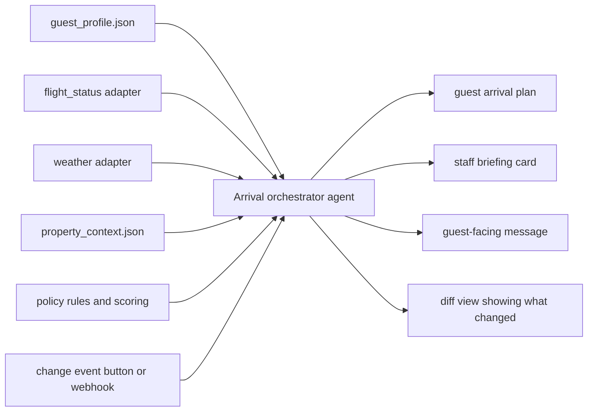

# Agentic Coding Playbook for the Hospitality 2030 Hackathon

## Executive summary

Based on the uploaded participant guide, this hackathon has three official challenge areas: hyper-personalized arrival orchestration, the invisible concierge, and post-stay relationship continuity or guest memory. The practical build window is 10:30 AM to 5:00 PM, which gives 6.5 hours. Repositories must be public, demos must clearly isolate the work built during the hackathon itself, prior projects are not allowed, and the organizers explicitly warn against anti-projects such as basic RAG apps and Streamlit apps. fileciteturn0file0

That combination strongly favors an **agentic workflow product** over a generic chatbot. Rosewood’s own brand language centers on deeply personal experiences and “A Sense of Place,” while Rosewood Sand Hill specifically foregrounds Northern California identity, hyper-local ingredients, and experiences such as Asaya Spa, Afternoon Tea with Flamingo Estate, Ridge Rosé Reveal, Friday Nights @ Madera, and Bluejay Bikes. A project that feels **native to Rosewood Sand Hill** will almost certainly land better than a generic “AI concierge” wrapper. citeturn11view3turn11view0turn11view1turn11view2

No public scoring rubric surfaced in the participant guide text retrieved here or in the public Cerebral Valley event materials I reviewed. The guide includes judging windows, and the event announcement frames the audience as operators, investors, and Rosewood executives, but neither source exposes score weights or official criteria. The judging advice in this report is therefore an inference grounded in the rules, theme language, and event framing rather than a published rubric. fileciteturn0file0 citeturn7view0turn7view2

From a technical standpoint, the highest-probability move in a 6.5-hour sprint is usually **one tool-using agent with a narrow, deterministic workflow**, or at most a lightly stateful graph. Anthropic’s API documentation exposes tool use in the Messages API, LangChain v1 standardizes a high-level agent API, and LangGraph provides the lower-level stateful runtime when explicit control is needed. That makes a single-agent or small-graph design more reliable than a sprawling multi-agent stack unless the team already has real fluency with those abstractions. citeturn3search1turn3search7turn4search2turn4search18

The strongest idea under these constraints is an **arrival orchestrator for Rosewood Sand Hill**: a system that ingests a guest profile, travel signal, weather, and property-specific local context, then outputs a personalized arrival plan, a staff briefing, and a one-click re-plan when a key condition changes. It is the cleanest fit to the official problem statements, naturally demonstrates reasoning plus tool use in the ReAct sense, and can optionally add voice polish through ElevenLabs without making voice the critical path. fileciteturn0file0 citeturn6search0turn6search2turn3search2turn3search13

## What the hackathon actually rewards

The official materials do not tell you exactly how judges score entries, but they tell you very clearly what can disqualify a team and what kind of product the event wants to surface. Read that as a design brief: **theme fidelity, visible originality, operational usefulness, and a polished, non-generic demo**. fileciteturn0file0

| Constraint or signal | Official detail | Build implication |
|---|---|---|
| Problem fit | Projects must build into at least one of the three stated problem statements. fileciteturn0file0 | Anchor your README, demo title, and final pitch to one named challenge. |
| Timebox | Hacking starts at 10:30 AM and submissions are due at 5:00 PM, yielding 6.5 hours. fileciteturn0file0 | One polished vertical slice beats breadth every time. |
| Public and new work | Repos must be public; demos must only highlight work built during the event; prior work is disallowed. fileciteturn0file0 | Create the repo immediately, commit often, and show what was built today. |
| Team format | Teams may have up to four members; solo participation is allowed. fileciteturn0file0 | Keep a credible solo cut of the project in case execution slips. |
| Anti-project guidance | Basic RAG apps, Streamlit apps, image analyzers, and several generic chatbot categories are explicitly flagged as anti-projects. fileciteturn0file0 | Avoid “chat with hotel knowledge base.” Build a tool-using workflow with visible actions. |
| Event thesis | The event announcement emphasizes AI-powered concierge systems, autonomous workflows, and voice agents. fileciteturn0file0 | Workflow automation and voice can help, but only if they serve one crisp use case. |
| Judge audience | Final presentations are judged by operators, investors, and Rosewood executives. fileciteturn0file0 | Show guest impact, staff efficiency, and future extensibility. |
| Brand fit | Rosewood frames its brand around deeply personal experiences and “A Sense of Place.” citeturn11view3 | Recommendations should feel local, tasteful, and culturally grounded. |
| Property specificity | Rosewood Sand Hill markets Northern California experiences and local programming, not generic luxury filler. citeturn11view0turn11view1turn11view2 | Seed demo outputs with Sand Hill-specific experiences and language. |

A crucial inference follows from those constraints: **the winning pattern is probably not “more autonomy,” but “the right amount of orchestrated autonomy.”** The best entries will likely show the system ingesting multiple signals, making a tasteful decision, and surfacing something concrete that staff or guests can act on immediately. That interpretation is consistent with the official challenge wording, the anti-project list, and Rosewood’s own emphasis on personal, place-specific hospitality. fileciteturn0file0 citeturn11view3turn11view2

## Prioritized project ideas

The ideas below are ranked by five filters: alignment to the official problem statements, compliance with the anti-project list, likelihood of demonstrating genuine tool-using agency, feasibility in 6.5 hours, and strength of the live demo moment. That ranking is analytical rather than official. fileciteturn0file0

### Comparison matrix

| Priority | Idea | Official fit | Demo wow | Feasibility | Why it ranks here |
|---|---|---:|---:|---:|---|
| 1 | SenseArrival Orchestrator | Arrival | High | High | Best mix of theme fit, visible agency, and property-specific storytelling. |
| 2 | Service Brief Copilot | Arrival, Memory | Medium | Very high | Safest operational demo; directly echoes the guide’s example feature of staff auto-briefing. |
| 3 | Delay-to-Delight Recovery Agent | Arrival | High | High | Strong before/after demo; operational pain is easy for judges to grasp instantly. |
| 4 | QuietCue Invisible Concierge | Invisible Concierge | High | Medium | Very on-theme, but creepiness and signal quality must be handled carefully. |
| 5 | Rosewood Memory Engine | Post-stay | Medium | High | Strong continuity story and high business relevance. |
| 6 | Preference Passport | Arrival, Post-stay | Medium | High | Good cross-property continuity narrative, but can look dry unless visually staged well. |
| 7 | Voice Butler Relay | Invisible Concierge | High | Medium | Voice can impress, but it should be additive rather than the critical path. |
| 8 | Sense of Place Experience Matcher | Arrival, Invisible | Medium | High | Good taste play and easy to tailor, but it can drift toward “smart recommendations” unless agentic steps are explicit. |
| 9 | Occasion Radar | Post-stay | Medium | High | Easy to scope, but privacy and “creepy” perception must be guarded tightly. |
| 10 | Return Journey Composer | Post-stay | Medium | Medium-high | Good brand story, weaker urgency in a short live demo unless paired with vivid memory carryover. |

### Detailed idea briefs

**SenseArrival Orchestrator.** *Brief:* An agent that choreographs the guest’s arrival using a structured guest profile, a live or mocked travel signal, weather, and Rosewood Sand Hill property context. *Core features:* guest-preference memory, arrival plan generation, localized welcome amenity suggestion, only-what-matters staff brief, one-click re-plan after a delay or weather change. *Required APIs and tools:* LLM with tool use, flight-status provider, weather API, place or event lookup, local property context JSON, optional SMS or email. *Estimated build split:* 0:25 scope and schema; 0:55 adapter scaffolding; 1:15 orchestrator logic; 0:45 staff and guest renderers; 0:35 re-plan and diff view; 0:35 testing; 0:20 pitch; 1:40 contingency and polish. *Success metrics:* full plan in under 20 seconds; at least three signals reflected in the output; visible output change after a simulated disruption. *Demo outline:* show a returning guest profile; generate arrival plan; inject a flight delay; regenerate; highlight the updated guest itinerary and staff note. *Risk and mitigation:* live travel data can fail; keep a fixture-based fallback mode and a manual “delay event” button.

**Service Brief Copilot.** *Brief:* A compact operational agent that gives front desk or guest relations a sixty-second briefing before guest arrival or during a shift handoff. *Core features:* preference continuity, calm do-and-don’t service guidance, likely delight opportunity, risk note, and a reason trace showing what signals mattered. *Required APIs and tools:* LLM, guest-history store, travel or weather context, property context, optional task-list export. *Estimated build split:* 0:20 schema; 0:45 data ingestion; 1:05 briefing engine; 0:40 structured output validation; 0:40 UI card; 0:35 tests; 0:20 pitch; 2:05 polish and backup assets. *Success metrics:* brief under 150 words; at least one high-confidence delight action; no irrelevant or generic notes. *Demo outline:* load guest; show raw signals; generate briefing card; then reveal how that card changes when the guest arrival window shifts. *Risk and mitigation:* it can look like summarization instead of agency; show tool calls and a confidence-scored action recommendation, not just prose.

**Delay-to-Delight Recovery Agent.** *Brief:* A narrowly scoped arrival rescue system that turns disruptions into proactive service recovery. *Core features:* disruption detection, revised check-in timing, adjusted dining or spa recommendation, guest-facing reassurance note, internal staff action list. *Required APIs and tools:* LLM, flight-status provider or mock event trigger, property context, optional messaging. *Estimated build split:* 0:20 scenario design; 0:45 trigger logic; 1:10 rescue planner; 0:45 action-list generator; 0:35 UI; 0:35 tests; 0:20 pitch; 2:00 contingency. *Success metrics:* re-plan in under 10 seconds; each suggested action tied to an explicit trigger; guest-facing note stays tasteful, not robotic. *Demo outline:* show original arrival plan; trigger a delay; watch the agent swap timing, in-room amenity, and staff instructions in one pass. *Risk and mitigation:* the use case can feel narrow; mitigate by quantifying why recovery moments disproportionately matter in luxury hospitality.

**QuietCue Invisible Concierge.** *Brief:* An ambient recommendation engine that interprets subtle in-stay behavior and surfaces one well-timed suggestion without crossing the line into surveillance. *Core features:* signal scoring, recommendation gating, explanation layer, “do not nudge” threshold, provenance display for every signal used. *Required APIs and tools:* LLM, synthetic event stream, preference memory, optional voice or messaging. *Estimated build split:* 0:30 consent model and signal schema; 0:45 event simulator; 1:15 recommendation engine; 0:45 guardrail logic; 0:35 UI; 0:35 tests; 0:20 pitch; 1:25 contingency. *Success metrics:* one high-confidence suggestion at a time; zero “creepy” flags in your own rule check; recommendation contains clear justification. *Demo outline:* replay an in-stay sequence; let the agent wait; show the exact moment a single tasteful suggestion becomes eligible. *Risk and mitigation:* this is the easiest idea to make creepy; mitigate by surfacing provenance, thresholds, and explicit exclusions.

**Rosewood Memory Engine.** *Brief:* A post-stay system that extracts meaningful memories from the stay and composes future outreach that feels remembered rather than spammy. *Core features:* memory extraction, structured memory store, event or anniversary matcher, outreach draft generation, cadence control. *Required APIs and tools:* LLM, database, event lookup, email or SMS channel. *Estimated build split:* 0:25 memory schema; 0:45 extraction pipeline; 1:10 memory store and retrieval; 0:45 outreach composer; 0:35 UI; 0:35 tests; 0:20 pitch; 1:55 contingency. *Success metrics:* at least three structured memories per stay; outreach references one memory plus one future fit; no boilerplate tone. *Demo outline:* ingest a past stay summary; show extracted memory objects; generate a future outreach for a likely return moment. *Risk and mitigation:* can look like CRM automation; mitigate by showing specific, high-signal memories and a clear anti-spam throttle.

**Preference Passport.** *Brief:* A cross-property continuity layer that translates guest preferences into local adaptations at the next Rosewood property. *Core features:* structured preference profile, conflict resolution, local-context adapter, staff summary, guest-facing personalization note. *Required APIs and tools:* LLM, memory store, property-context JSON for multiple locations, optional admin UI. *Estimated build split:* 0:25 schema; 0:45 profile importer; 1:10 local adaptation logic; 0:45 output generation; 0:35 UI; 0:30 tests; 0:20 pitch; 2:00 contingency. *Success metrics:* same core preference rendered differently for two properties; concise explanation of why the adaptation changed; no preference contradictions. *Demo outline:* show one guest across two Rosewood contexts; render the “same guest, different sense of place” adaptation. *Risk and mitigation:* can feel abstract; mitigate with a side-by-side visual diff and a sharply localized Sand Hill example.

**Voice Butler Relay.** *Brief:* A voice-enabled front end that converts a guest request into a structured operational plan and a concise staff handoff. *Core features:* speech input, intent parsing, task planning, output routing, transcript and summary card. *Required APIs and tools:* ElevenLabs or equivalent voice stack, LLM, task queue or mock ops console. *Estimated build split:* 0:20 voice scope; 0:45 speech and transcript integration; 1:00 planner; 0:45 staff handoff renderer; 0:35 UI; 0:35 latency tests; 0:20 pitch; 2:10 contingency. *Success metrics:* complete round trip under 5–8 seconds; transcript accuracy good enough for structured tasking; staff summary clearer than raw transcript. *Demo outline:* play one guest utterance; show transcription; show the planned service task and the hospitality-toned reply. *Risk and mitigation:* voice latency can kill demos; keep prerecorded audio and a transcript-first fallback path.

**Sense of Place Experience Matcher.** *Brief:* An agent that converts guest tastes into a Sand Hill-specific set of experiences and dining moments, avoiding generic tourist recommendations. *Core features:* preference parsing, local program ranking, diversity filter, itinerary assembly, “why this fits” explanation. *Required APIs and tools:* LLM, Google Places or event lookup, property context JSON, optional map view. *Estimated build split:* 0:20 property-context prep; 0:45 taste parser; 1:00 ranking logic; 0:45 itinerary builder; 0:35 UI; 0:30 tests; 0:20 pitch; 2:15 contingency. *Success metrics:* itinerary includes at least one official property program and one off-property complement; every suggestion cites a preference match; no generic filler. *Demo outline:* load guest preferences; generate a day-one plan grounded in actual Sand Hill experiences. *Risk and mitigation:* it can drift toward “just a recommender”; mitigate by making the toolchain visible and outputting both guest and staff artifacts.

**Occasion Radar.** *Brief:* A restrained lifecycle agent that detects meaningful moments such as anniversaries or return patterns and suggests a tasteful activation. *Core features:* occasion extraction, importance scoring, privacy guardrails, gift or experience selection, draft outreach. *Required APIs and tools:* LLM, memory store, optional calendar or event source, email or SMS. *Estimated build split:* 0:25 schema; 0:40 detector; 1:00 scoring and guardrails; 0:45 recommendation engine; 0:35 UI; 0:30 tests; 0:20 pitch; 2:15 contingency. *Success metrics:* only high-confidence occasions trigger; recommendations include a reason and a confidence score; outreach remains short and elegant. *Demo outline:* ingest synthetic guest history; detect an upcoming moment; show the proposed activation with rationale and suppression logic. *Risk and mitigation:* privacy perception is delicate; use only explicit internal or synthetic signals and make that visible.

**Return Journey Composer.** *Brief:* A post-stay re-engagement agent that predicts a plausible return window and proposes a future stay concept tied to new local programming. *Core features:* return-window hypothesis, event matching, refreshed itinerary, memory-aware messaging. *Required APIs and tools:* LLM, event lookup, memory store, email. *Estimated build split:* 0:20 schema; 0:45 memory retrieval; 1:00 return hypothesis logic; 0:45 itinerary and message generation; 0:35 UI; 0:30 tests; 0:20 pitch; 2:15 contingency. *Success metrics:* future plan references past memory plus new local context; message feels bespoke rather than promotional; reasoning chain is inspectable. *Demo outline:* show a prior stay; infer a likely future stay moment; generate a return concept built around a current Sand Hill program. *Risk and mitigation:* urgency can feel weaker than arrival or in-stay ideas; mitigate by giving the return concept a vivid and timely local anchor.

## Recommended idea and minimal implementation

**Recommended build:** **SenseArrival Orchestrator**.

It is the best fit because it maps directly onto the first official problem statement, incorporates the guide’s example features such as pre-arrival orchestration and staff briefing, and lets you show concrete “reasoning plus action” rather than a generic conversational interface. It also benefits from Rosewood’s “A Sense of Place” brand language and Sand Hill’s clearly documented local experiences, which makes the demo feel tailored rather than templated. fileciteturn0file0 citeturn11view3turn11view0turn11view2

### Recommended architecture



The minimal viable version should **not** attempt a full hotel OS. It only needs to prove one sharp claim: *given a guest profile and a changing arrival context, the system can produce a better, more local, and more operationally useful arrival plan than a human starting from scratch in the same time window*. That is already plenty for this hackathon. fileciteturn0file0

### Minimal scope contract

| Include in MVP | Defer unless you finish early |
|---|---|
| Returning guest profile in JSON | Full CRM or PMS integration |
| One live or mocked flight/delay signal | Background monitoring daemons |
| One weather lookup | Multi-channel notification routing |
| Sand Hill property context from official pages | Social-signal ingestion from external platforms |
| Two outputs: guest plan and staff brief | Rich voice UX as a dependency |
| One visible re-plan event | Cross-property portfolio support |

This “minimal scope contract” is important because the official challenge mentions guest history, flight data, social signals, and local context, but you do **not** need to operationalize every possible data source to make a convincing demo. A narrower implementation with real re-planning is stronger than a broader but brittle one. fileciteturn0file0

### Step-by-step build plan

| Timebox | Task | Code modules | Deliverable | Fallback if blocked |
|---|---|---|---|---|
| 10:30–10:50 | Freeze scope, persona, and outputs | `README.md`, `docs/demo_contract.md` | One-sentence problem, one persona, exact demo path | Drop guest-facing message and keep plan + staff brief only |
| 10:50–11:20 | Create public repo and scaffold app | `main.py` or `server.ts`, `.env.example` | Running local server and empty UI | Use plain HTML page instead of React |
| 11:20–11:50 | Build property context and mock guest data | `data/property_context.json`, `data/guest_profiles.json` | High-quality Sand Hill-specific fixtures | Hardcode one persona if schema work drags |
| 11:50–12:35 | Implement tool adapters | `tools/flight.*`, `tools/weather.*`, `tools/local_context.*` | Flight, weather, and property-context functions | Replace live APIs with fixture JSON |
| 12:35–13:20 | Create orchestrator and policy scorer | `agents/orchestrator.*`, `scoring.*`, `prompts/system.*` | Structured arrival plan JSON | Render raw JSON if templated UI is late |
| 13:20–14:00 | Build staff and guest renderers | `renderers/staff.*`, `renderers/guest.*` | Two polished response cards | Collapse to one combined markdown report |
| 14:00–14:35 | Add change-event re-plan flow | `routes/replan.*`, `ui/diff_view.*` | “What changed?” comparison | Manual second run with changed input |
| 14:35–15:10 | Add guardrails and explanation | `policy/privacy.*`, `policy/confidence.*` | Why-each-action-was-chosen panel | Show confidence tags only |
| 15:10–15:45 | Smoke testing and fixture replay | `tests/test_tools.*`, `tests/test_schema.*` | Passing smoke suite and known-good demo fixtures | Skip automated tests, keep scripted manual test sheet |
| 15:45–16:20 | Demo polish and narrative | `docs/demo_script.md`, screenshots | Tight live script with backup assets | Record short backup video or GIF |
| 16:20–17:00 | Submit and rehearse | final repo cleanup | Submission-ready repo and final demo run | Submit earlier with simpler UI if unstable |

### Suggested code module map

| Module | Responsibility |
|---|---|
| `data/guest_profiles.json` | Synthetic guest histories, preferences, prior stay details |
| `data/property_context.json` | Sand Hill experiences, dining, wellness, local flavor cues |
| `tools/flight.py` or `tools/flight.ts` | Fetch or mock current flight status and ETA |
| `tools/weather.py` or `tools/weather.ts` | Fetch weather and format it for planning |
| `tools/local_context.py` or `tools/local_context.ts` | Return Sand Hill experiences and local context |
| `agents/orchestrator.py` or `agents/orchestrator.ts` | Main tool-using agent loop |
| `scoring.py` or `scoring.ts` | Rank delight actions by fit, confidence, and privacy posture |
| `renderers/staff.py` or `renderers/staff.ts` | Produce concise internal briefing card |
| `renderers/guest.py` or `renderers/guest.ts` | Produce guest-facing arrival plan or message |
| `tests/test_schema.py` or `tests/test_schema.ts` | Validate output structure and critical edge cases |

### Testing strategy and fallback ladder

Testing should stay brutally simple. Smoke-test every adapter independently, keep one golden fixture for the primary happy path, and keep one fixture for the disruption path. Validate that the final output always contains four things: arrival plan, staff brief, one clearly justified delight moment, and one re-plan diff. If any live external dependency becomes flaky, switch to a **fixture replay mode**; if the UI breaks, render markdown cards; if voice is late, remove it entirely. The official rules reward clarity of original work, not unnecessary integration volume. fileciteturn0file0

Your cut order should be: first remove voice, then remove messaging, then remove live travel lookup, and only last remove the re-plan diff. The diff is the most important proof that the system is actually acting on changing context rather than simply generating static prose.

## Frameworks and orchestration options

The comparison below is grounded in official documentation and the original ReAct paper; the **setup-time estimates are my own hackathon judgments**, not vendor claims. citeturn3search0turn3search1turn3search2turn3search7turn4search0turn4search1turn4search2turn5search0turn5search2turn6search0turn4search3

| Option | Best use in this hackathon | Pros under 6.5 hours | Cons under 6.5 hours | Estimated setup time | Official source |
|---|---|---|---|---:|---|
| Raw Anthropic SDK plus custom tool loop | Best default for the recommended idea | Lowest abstraction, fastest path to visible tool use, easy to keep scope tight | You must hand-roll orchestration, state, and retries | 15–25 min | Anthropic quickstart and tool-use docs. citeturn3search0turn3search1turn3search22 |
| LangChain `create_agent` | Fast path if you already know LangChain | High-level agent interface, works in Python and JS, easy tool wrappers | Another abstraction layer can hide mechanics during a live demo | 25–40 min | LangChain v1 and agent docs. citeturn3search3turn3search7turn3search21 |
| LangGraph | When you want explicit state and transitions | Strong control over stateful workflows and re-planning | More ceremony than raw SDK or LangChain | 40–70 min | LangGraph overview and quickstart. citeturn4search2turn4search14turn4search18 |
| AutoGen AgentChat | If the team already builds multi-agent systems | Powerful for agent teams, officially positioned as beginner-friendly within AutoGen’s high-level API | Easy to over-engineer the demo for this timebox | 45–90 min | AutoGen docs and AgentChat guide. citeturn4search0turn4search12turn4search4 |
| CrewAI Flows | If you like role-based agent orchestration and already know CrewAI | Nice mental model for flows, state, and agent roles | Framework overhead is real in a one-day sprint | 45–90 min | CrewAI docs and quickstart. citeturn4search1turn4search5turn4search9 |
| Mastra | Good TypeScript-first choice for quick prototypes | TS-native, project creation is streamlined, nice for app-style integration | Smaller mindshare than LangChain ecosystem | 30–60 min | Mastra docs and homepage. citeturn5search2turn5search6turn5search14 |
| BabyAGI | Inspiration only | Can spark lightweight planning ideas | Official repo explicitly cautions it is not meant for production use; original repo is archived | 20–40 min to explore, not recommended to depend on | BabyAGI repository notices. citeturn4search3turn4search7 |
| MCP | Helpful if an existing connector unlocks a dataset or tool quickly | Open standard for tool/data integration; future-proof mental model | Connector setup can consume critical time | 30–90+ min | MCP official docs and Anthropic MCP docs. citeturn5search0turn5search12turn5search5 |
| ReAct | Pattern, not framework | Excellent prompt design for “reason, act, observe” behavior; nearly zero extra tooling | Needs iteration limits and good tool descriptions to stay disciplined | 0–15 min conceptually | Original ReAct paper. citeturn6search0turn6search2 |
| ElevenLabs voice layer | Optional polish layer when voice is central to the concept | Strong voice demo value, official Python and TS SDKs, supports conversational agents | Latency and audio UX can become the entire demo risk | 20–40 min for basic TTS/STT, more for polished conversational flow | ElevenLabs docs. citeturn3search2turn3search13turn3search20 |

A practical recommendation follows from that table. If your team is strongest in **Python**, use raw Anthropic SDK plus FastAPI and simple templates, optionally adding LangGraph only if you need explicit state transitions. If your team is strongest in **TypeScript**, use raw Anthropic SDK plus Express or Next.js, or Mastra if your team already knows it. Only reach for AutoGen or CrewAI if someone on the team can stand up the scaffold from memory without thinking. citeturn3search0turn3search1turn5search2turn4search12turn4search1

## Prerequisites and quick-start setup

The official quickstarts make three things straightforward: Anthropic provides official SDKs and a quickstart for the Claude API, ElevenLabs provides official Python and Node libraries, and the major orchestration frameworks each have their own quickstarts. The right hackathon move is to prepare **one minimal stack**, not several alternatives half-installed. citeturn3search0turn3search20turn3search3turn4search1turn5search2

### Readiness checklist

| Item | Why it matters |
|---|---|
| Public GitHub repository from minute one | The rules require a public repo and clearly visible new work. fileciteturn0file0 |
| One named challenge statement in README | Judges should never wonder which official problem you are solving. fileciteturn0file0 |
| Two guest personas plus one disruption scenario | Gives you both a normal path and a re-plan moment |
| `property_context.json` built from official Sand Hill pages | Makes the output localized and brand-fit. citeturn11view0turn11view1turn11view2 |
| One fallback fixture per external API | Lets you survive network or account failures |
| `.env.example` in repo | Speeds teammate setup and proof of originality |
| No Streamlit dependency | Streamlit applications are explicitly on the anti-project list. fileciteturn0file0 |
| Only rights-cleared or synthetic data/assets | Using unowned code, data, or assets is disqualifying. fileciteturn0file0 |

### External data and service options

A useful pattern is to pick **one provider per need**, not all of them.

| Capability | Option | Why it is useful here | Caveat | Official source |
|---|---|---|---|---|
| Flight status | Aviationstack | Real-time and future flight data is enough for arrival or delay demos | Keep a fixture fallback in case key setup takes too long | Aviationstack docs. citeturn9search3turn9search6 |
| Weather | OpenWeather | Easy arrival-context signal and obvious demo value | Use only one endpoint; don’t overbuild weather logic | OpenWeather docs. citeturn9search0turn9search4 |
| Places and POI | Google Places | Strong fit for local context and nearby experiences | Billing and API-key setup add friction | Google Places docs. citeturn9search2turn9search12turn9search16 |
| Events | Ticketmaster Discovery | Helpful for future trips or local programming suggestions | Not every property-specific experience will appear there | Ticketmaster Discovery docs. citeturn9search1 |
| Messaging | Twilio Messaging | Easy if you want a guest-facing SMS or WhatsApp handoff | Message compliance and setup can slow you down | Twilio Messaging docs. citeturn10search0turn10search4 |
| Email | Resend | Lightweight option for post-stay outreach demos | Nice-to-have rather than core to arrival demos | Resend docs. citeturn10search1 |
| Memory store | PostgreSQL `json` or `jsonb` | Great for structured preference and memory objects | You do not need full relational rigor for an MVP | PostgreSQL docs. citeturn10search3turn10search9 |

### Python quick start

```bash
python3 -m venv .venv
source .venv/bin/activate
pip install --upgrade pip

pip install anthropic elevenlabs fastapi uvicorn python-dotenv httpx pydantic jinja2

# optional if you choose a framework
pip install langchain langgraph
```

### Node and TypeScript quick start

```bash
npm init -y
npm install @anthropic-ai/sdk @elevenlabs/elevenlabs-js express zod dotenv
npm install -D typescript tsx @types/node

# optional if you choose a framework
npm install langchain @langchain/langgraph
```

The SDK names and setup pattern above follow the official Anthropic and ElevenLabs documentation, while the optional packages match the official LangChain and LangGraph docs. citeturn3search0turn3search20turn3search3turn4search14

### Environment file template

```bash
ANTHROPIC_API_KEY=
ELEVENLABS_API_KEY=
FLIGHT_API_KEY=
WEATHER_API_KEY=
PLACES_API_KEY=
EVENTS_API_KEY=
TWILIO_ACCOUNT_SID=
TWILIO_AUTH_TOKEN=
RESEND_API_KEY=
```

### Property context seed file

This is the fastest way to make the demo feel like **Rosewood Sand Hill**, not “hotel app number 47.”

```json
{
  "property_name": "Rosewood Sand Hill",
  "brand_principles": [
    "A Sense of Place",
    "deeply personal experiences",
    "high-touch service"
  ],
  "context_tags": [
    "Northern California",
    "local seasonal ingredients",
    "well-being",
    "restoration",
    "innovation"
  ],
  "official_experiences": [
    "Asaya Spa",
    "Afternoon Tea with Flamingo Estate",
    "Ridge Rosé Reveal",
    "Friday Nights @ Madera",
    "Bluejay Bikes"
  ]
}
```

Those property and brand cues are drawn directly from Rosewood’s official brand and Sand Hill property pages. citeturn11view3turn11view0turn11view1turn11view2

### Minimal Anthropic tool-loop template

```python
import json
import os
from anthropic import Anthropic

client = Anthropic(api_key=os.environ["ANTHROPIC_API_KEY"])

TOOLS = [
    {
        "name": "get_weather",
        "description": "Return local weather for arrival planning.",
        "input_schema": {
            "type": "object",
            "properties": {"location": {"type": "string"}},
            "required": ["location"],
        },
    },
    {
        "name": "get_property_context",
        "description": "Return Rosewood Sand Hill experiences and brand context.",
        "input_schema": {"type": "object", "properties": {}, "required": []},
    },
]

def get_weather(location: str) -> dict:
    # replace with your real provider or fixture replay
    return {"location": location, "summary": "Clear, 67F, light evening breeze"}

def get_property_context() -> dict:
    with open("data/property_context.json", "r", encoding="utf-8") as f:
        return json.load(f)

tool_map = {
    "get_weather": get_weather,
    "get_property_context": lambda: get_property_context(),
}

def run_agent(user_prompt: str) -> str:
    messages = [{"role": "user", "content": user_prompt}]

    while True:
        response = client.messages.create(
            model="YOUR_MODEL_NAME",
            max_tokens=1200,
            tools=TOOLS,
            messages=messages,
        )

        tool_uses = [b for b in response.content if getattr(b, "type", None) == "tool_use"]
        if not tool_uses:
            return "\n".join(
                b.text for b in response.content if getattr(b, "type", None) == "text"
            )

        messages.append({"role": "assistant", "content": response.content})

        for tool in tool_uses:
            result = tool_map[tool.name](**tool.input)
            messages.append(
                {
                    "role": "user",
                    "content": [
                        {
                            "type": "tool_result",
                            "tool_use_id": tool.id,
                            "content": json.dumps(result),
                        }
                    ],
                }
            )
```

This pattern is intentionally plain. In a 6.5-hour hackathon, clarity of the tool loop is often an advantage because judges can see the system actively consult context and revise its plan. Anthropic’s official docs describe the tool-use loop and client SDKs, and Claude Code’s quickstart plus MCP support can help a team scaffold code faster if you already use it as a coding assistant. citeturn3search1turn3search22turn3search15turn5search9

## Judging hooks, risks, and timeline

Because no public scorecard was recovered, the table below is a **working internal rubric**, not an official one. It is designed to help you optimize the demo for the audience described in the official materials. fileciteturn0file0 citeturn7view2

| Inferred judge lens | Suggested internal weight | Why it likely matters | Scoring hook to emphasize |
|---|---:|---|---|
| Official theme fit | 30 | The event is tightly anchored to named problem statements and future-of-hospitality storytelling | Open by naming the exact problem statement you are solving |
| Visible originality | 20 | The rules explicitly require public repos and work built during the event | Show the public repo, timeline of commits, and a tight “built today” feature list |
| Technical depth | 20 | The event language emphasizes intelligent concierge systems, autonomous workflows, and voice agents | Show tool calls, structured output, and re-planning on changed context |
| Hospitality taste and privacy restraint | 15 | The “Invisible Concierge” prompt explicitly warns against creepiness | Show guardrails, confidence thresholds, and why the system withheld weaker suggestions |
| Operational usefulness | 10 | Rosewood operators and executives will care about staff usability, not only guest-facing sparkle | Always include the internal staff brief or task list |
| Demo polish | 5 | Short demos reward control and clarity | Keep the story to one use case and one change event |

A strong pitch should sound like this in structure, even if you use different wording: **“Rosewood does not need another chatbot. It needs a system that turns fragmented signals into one confident, high-touch action plan. We built that for the arrival moment, and here is the re-plan when real-world context changes.”** That framing keeps you close to the official challenge language while making the business outcome obvious. fileciteturn0file0 citeturn11view3

The most effective demo rhythm is usually five beats long. First, set the guest and the property context in about twenty seconds. Second, run the normal-case plan once. Third, inject a change event such as a delay, weather shift, or mood cue. Fourth, show the staff-facing output, not just the guest-facing prose. Fifth, close on why this improves both service quality and staff readiness. That pattern makes the “agentic” aspect legible.

### Cross-cutting risk map

| Risk | Why it hurts | Mitigation |
|---|---|---|
| Genericity | Judges see a chatbot instead of a hospitality product | Use Sand Hill-specific content, not generic hotel copy |
| Live API fragility | Demo breaks in public | Build every tool with a fixture replay mode |
| Creepiness | Especially dangerous on Invisible Concierge ideas | Show provenance, confidence, and suppression logic |
| Over-scoping | You lose polish and fail to land one memorable moment | Enforce a minimal scope contract and a cut order |
| Hidden authorship | Risks disqualification under the “built during event” rule | Keep the repo public and narrate exactly what was built today |
| Voice dependency | Audio issues can consume the entire demo | Make voice optional, not foundational |

The timeline below assumes the official hacking window of 10:30 AM to 5:00 PM from the participant guide. fileciteturn0file0

```mermaid
timeline
    title Recommended 6.5-hour build flow
    10:30 to 10:50 : Freeze scope, persona, outputs, and success metric
    10:50 to 11:20 : Create public repo, env file, and server or UI skeleton
    11:20 to 11:50 : Build guest fixtures and property_context.json
    11:50 to 12:35 : Implement flight, weather, and local-context adapters
    12:35 to 13:20 : Build orchestrator loop and scoring rules
    13:20 to 14:00 : Render staff brief and guest arrival plan
    14:00 to 14:35 : Add change-event re-plan and diff view
    14:35 to 15:10 : Add guardrails, confidence, and explanation layer
    15:10 to 15:45 : Smoke tests, fixture replay mode, and latency cleanup
    15:45 to 16:20 : Demo polish, screenshots, repo cleanup, narrative
    16:20 to 17:00 : Final rehearsal, backup demo assets, and submission
```