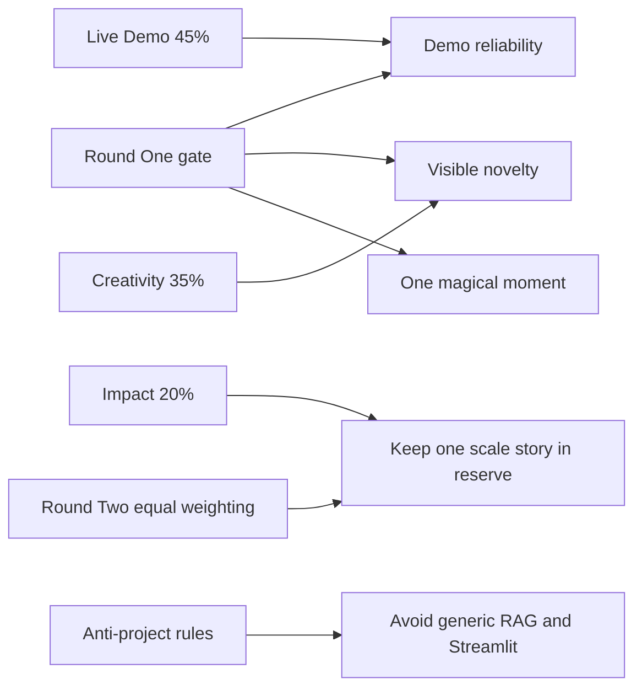
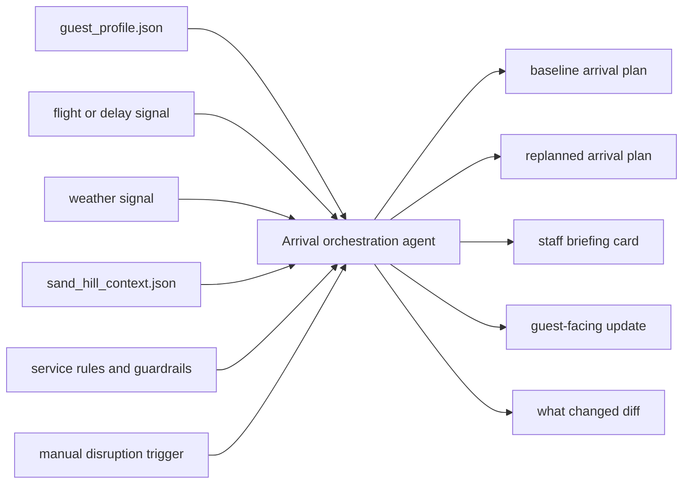

# Updated Agentic Coding Playbook for Hospitality 2030

## Executive summary

The judging details materially change the optimal hackathon strategy. In Round One, each team gets about **3 minutes of live demo** followed by **1–2 minutes of Q&A**, and the score is weighted **45% Live Demo, 35% Creativity and Originality, and 20% Impact Potential**. Only the **top six teams** advance. In Round Two, the same three categories are used again, but they are weighted equally. The practical implication is straightforward: the project should be optimized first to **survive the Round One gate** with a highly reliable, easy-to-follow, visibly novel demo, and only then layered with a concise impact story for finals. fileciteturn1file0

That means the prior playbook should be updated in four important ways. Scope should narrow to **one unmistakable agentic moment** rather than a broad hospitality platform. Idea ranking should shift toward concepts with a crisp **before-and-after transformation** that works in under three minutes. Stack selection should prefer **raw tool calling or a light agent framework** over complicated multi-agent orchestration. Time allocation should move more heavily toward **fallback mode, rehearsal, and demo hardening**, because Live Demo is now the largest scoring bucket in Round One. Anthropic’s official tool-use model and LangChain’s current high-level agent API both support that tighter build style well. fileciteturn1file0 citeturn4view2turn4view3turn4view4

The recommended concept also changes slightly. The best overall build is no longer a broad “arrival orchestrator” in the abstract, but a narrower **Delay-to-Delight Arrival Orchestrator**: a system that creates a personalized arrival plan for a Rosewood Sand Hill guest, then visibly **re-plans** when a disruption occurs, while simultaneously generating a concise staff brief and a guest-facing update. That preserves direct alignment with the official **Hyper-Personalized Arrival Orchestration** prompt, while making the live demo much sharper and more stageable. It also lets the team express Rosewood’s official “A Sense of Place” philosophy through Sand Hill-specific experiences such as Asaya Spa, California Afternoon Tea with Flamingo Estate, Ridge Rosé Reveal, Friday Nights @ Madera, Clubhouse Series, Bluejay Bikes, and locally grounded food-and-wellness language. fileciteturn1file0 citeturn6view0turn4view0turn4view1

## What the judging update changes

The table below translates the official judging rubric and event rules into concrete build strategy. All rubric, timing, and rule details come from the updated participant guide. fileciteturn1file0

| Official constraint or weight | What it now means for the playbook |
|---|---|
| Round One: Live Demo 45% | Build reliability outranks architectural ambition. The core flow must work cleanly on the first try. |
| Round One: Creativity 35% | Generic “AI concierge” or “chat with hotel context” ideas are underpowered even if they function. |
| Round One: Impact 20% | Impact still matters, but you only need a crisp scalability story, not a full enterprise platform. |
| Round Two: equal weighting | If you reach finals, you need a stronger business and deployment story ready to append. |
| Three-minute demo in both rounds | Your product needs one memorable transformation, not three partially working features. |
| Round One judged in separate rooms | Room acoustics, network variance, and laptop audio make fragile voice-first demos riskier. |
| Basic RAG and Streamlit are anti-projects | Avoid “knowledge-base chatbot” patterns and avoid Streamlit entirely. |
| Public repo; only hackathon-built work can be shown | Show your commit trail, built-today scope, and clearly isolate what you created on-site. |

A good mental model for the updated strategy is this:



The most important non-obvious change is that **local specificity is now part of the scoring strategy**. Rosewood’s official brand story emphasizes deeply personal experiences, connections between people and place, and “A Sense of Place.” Sand Hill’s own property language adds a concrete Northern California frame: it calls itself a “modern clubhouse for Silicon Valley,” emphasizes shared well-being, highlights local seasonal ingredients from named regional producers, and promotes official experiences such as Asaya Spa, Afternoon Tea with Flamingo Estate, Ridge Rosé Reveal, Friday Nights @ Madera, Clubhouse Series, and Bluejay Bikes. In practice, this means originality does **not** have to come from exotic agent architecture; it can come from making the agent feel unmistakably like **Rosewood Sand Hill**, not a generic luxury hotel UI. citeturn6view0turn4view0turn4view1

A second important update is procedural. Because submissions are due at **5:00 PM** and first-round judging begins immediately in the **5:00 PM–6:45 PM** window, there is effectively **no safe post-deadline hardening window**. The team should assume that the project must be demo-ready before final submission, not after it. fileciteturn1file0

## Reprioritized project slate

The ranking below is an **analyst estimate**, not an official scorecard. It uses the official Round One weights as the primary gate because the top-six cut happens there. The descriptions and risks are intended to replace the original priority order in the playbook. fileciteturn1file0

| Rank | Idea | Why it now scores better or worse under the official rubric | Round One fit | Primary risk | Mitigation |
|---|---|---|---:|---|---|
| 1 | **Delay-to-Delight Arrival Orchestrator** | Best live-demo shape: baseline plan, disruption trigger, instant re-plan, staff brief. Strong creativity if localized to Sand Hill. | **8.7/10** | Can feel narrow | Add one sentence on portfolio-scale reuse across properties |
| 2 | **SenseArrival Orchestrator** | Still highly aligned with Problem Statement 1, but broader scope can dilute the magic moment | **8.2/10** | Too many moving parts | Strip to one persona, one disruption, one local delight |
| 3 | **QuietCue Invisible Concierge** | Very strong originality and direct fit to Problem Statement 2 | **7.9/10** | Can feel creepy or speculative | Show provenance, consent assumptions, and one-item-only nudging |
| 4 | **Service Brief Copilot** | Extremely demo-safe and operationally legible, but creativity score is capped unless the insight synthesis is impressive | **7.8/10** | Can look like summarization | Show tool calls plus ranked action recommendations, not prose summary |
| 5 | **Preference Passport** | Good cross-property impact story and moderate novelty | **7.6/10** | Can feel abstract in a short demo | Use side-by-side adaptation: same guest, different property context |
| 6 | **Voice Butler Relay** | Voice can create a wow moment, but room-based judging increases fragility | **7.4/10** | Latency or audio failure | Make voice optional and keep transcript-first fallback |
| 7 | **Sense of Place Experience Matcher** | Easy to localize and stage, but originality is weaker unless the agent visibly reasons across tools | **7.2/10** | Looks like a recommender | Show tool provenance and staff-facing adaptation logic |
| 8 | **Rosewood Memory Engine** | Strong long-term impact, but harder to make emotionally vivid in three minutes | **7.1/10** | Feels like CRM automation | Show structured memories and a tasteful, non-spam cadence rule |
| 9 | **Occasion Radar** | Decent originality and impact, but privacy perception can drag both demo and Q&A | **7.1/10** | “Too creepy” response | Restrict to explicit internal or synthetic signals; show suppression rules |
| 10 | **Return Journey Composer** | Good impact story, weakest urgency in a short live demo | **6.9/10** | Lacks immediate drama | Pair it with a current Sand Hill experience or event to sharpen the reveal |

Two ideas rise the most under the real rubric. **Delay-to-Delight Arrival Orchestrator** rises because it naturally creates a before/after reveal, which is extraordinarily efficient in a three-minute scoring environment. **QuietCue Invisible Concierge** rises because originality is now explicitly worth 35% in Round One, but it only remains viable if privacy restraint is made visible in the product itself. By contrast, purely operational copilots and post-stay CRM-like ideas fall a little because they are easier to explain than to make memorable. fileciteturn1file0

The anti-project rules reinforce this reprioritization. Since the guide explicitly flags **basic RAG applications** and **Streamlit applications** as anti-projects, any idea that looks like “chat with hotel knowledge plus a couple of tool calls” is doubly weak: it risks both low creativity and rule-friction. The safest path is an **agentic workflow** with visible state change, not a conversational wrapper. fileciteturn1file0

## Updated recommended build

The recommended concept for the revised playbook is **Delay-to-Delight Arrival Orchestrator**, a scoped-down version of the earlier arrival idea. It is the cleanest fit to the official first problem statement because it can synthesize guest history, a travel signal, local context, and a delight action before arrival, and it naturally supports the guide’s example feature of auto-briefing hotel staff. It is also the most score-efficient design under the newly published rubric because it can prove implementation quality and creativity inside a very small demo footprint. fileciteturn1file0

The most persuasive version of this build should feel like a Rosewood Sand Hill arrival, not just a “luxury hotel” arrival. Sand Hill’s official site already gives you high-quality local anchors: performance-and-restoration framing, hyper-local ingredients, Asaya Spa, Flamingo Estate afternoon tea, Ridge Rosé Reveal, Clubhouse Series, Friday Nights @ Madera, and Bluejay Bikes. Those details make the output feel bespoke without requiring additional complex integrations. citeturn4view0turn4view1turn6view0

### Recommended demo architecture



### Minimal scope contract

| Must be in the MVP | Should be deferred unless time remains |
|---|---|
| One returning guest persona with preferences and prior stay memory | Multi-property support |
| One real or mocked flight/delay input | Persistent background monitors |
| One weather input | Full PMS or CRM integration |
| One Sand Hill property context file seeded from official pages | Voice as a critical dependency |
| One baseline plan and one re-plan | Multi-agent routing |
| One staff brief and one guest-facing message | Full messaging automation |

### Minimal implementation plan

| Time | Task | Modules | Output |
|---|---|---|---|
| 10:30–10:50 | Freeze concept, persona, and judging hook | `README.md`, `docs/demo.md` | One-line product thesis and exact demo path |
| 10:50–11:15 | Repo scaffold and public visibility | `app/`, `.env.example` | Running local app and public repo |
| 11:15–11:40 | Build fixtures and Sand Hill context | `data/guest.json`, `data/property_context.json` | High-quality local demo data |
| 11:40–12:35 | Implement tool adapters | `tools/flight.*`, `tools/weather.*`, `tools/context.*` | Working or mocked external signals |
| 12:35–13:25 | Implement orchestration loop | `agents/orchestrator.*`, `prompts/system.*` | Structured baseline arrival plan |
| 13:25–13:55 | Add staff and guest renderers | `renderers/staff.*`, `renderers/guest.*` | Readable cards, not raw JSON |
| 13:55–14:20 | Add disruption and re-plan diff | `routes/replan.*`, `renderers/diff.*` | “What changed?” moment |
| 14:20–14:45 | Add guardrails and confidence tags | `policy/*` | Non-creepy, explainable output |
| 14:45–15:20 | Fixture replay mode and smoke tests | `tests/*` | Demo-safe fallback mode |
| 15:20–15:50 | Locality and originality polish | `data/property_context.json`, UI copy | Sand Hill-specific delight actions |
| 15:50–16:20 | Demo script, README, judging notes | `docs/demo_script.md` | Submission-quality narrative |
| 16:20–16:40 | Full rehearsal plus backup assets | screenshots/GIF/video | Demo failover |
| 16:40–16:50 | Submit | repo + submission form | No coding after this point |
| 16:50–17:00 | Walk to judging reset | n/a | Calm handoff into Round One |

That allocation is intentionally more conservative than the original plan because the newly published rubric makes demo performance the single largest determinant in Round One. The team should be comfortable cutting voice, messaging, or live flight APIs before cutting the **re-plan diff**, because the diff is the clearest proof that the system is acting on changing context rather than generating static hospitality prose. fileciteturn1file0

### Output contract

```json
{
  "plan_version": "baseline",
  "guest_name": "Synthetic Persona",
  "arrival_window": "2026-05-16T18:10:00-07:00",
  "delight_actions": [
    {
      "action": "Hold California Afternoon Tea-inspired in-room welcome",
      "why": "Guest previously favored calm arrival rituals and local culinary experiences",
      "confidence": 0.87
    }
  ],
  "staff_brief": {
    "tone": "quiet and restorative",
    "must_do": ["prepare room preference", "hold dining option"],
    "avoid": ["push loud bar recommendation"]
  },
  "guest_message": "Welcome back. We have adjusted your arrival plan.",
  "changed_reason": ["flight delay", "cooler evening weather"]
}
```

Constrain the model to a schema like this, and use strict tool definitions or structured output so malformed output never becomes the reason the live demo fails. Anthropic’s tool-use documentation explicitly supports tool loops with user-defined functions and notes that `strict: true` can guarantee exact schema conformance for tool calls. citeturn4view2

## Updated tools and setup

The judging update shifts the tooling recommendation toward **simpler, more transparent orchestration**. Anthropic’s Messages API and tool-use flow are sufficient for the recommended build on their own. LangChain’s `create_agent` is now the standard high-level agent interface in v1 and is built around the same basic model-tool loop. LangGraph remains useful when you need explicit state, persistence, or human-in-the-loop control, but it is no longer the default choice for a three-minute hospitality demo unless a team member already knows it well. citeturn4view2turn4view3turn4view4turn11search2

### Framework and orchestration inventory

| Option | Best use now | Pros | Cons | Setup time estimate | Verdict under current judging |
|---|---|---|---|---:|---|
| **Raw Anthropic SDK** | Default choice for the recommended idea | Fastest path, minimal abstraction, easy to debug live | You own orchestration and retries | 15–25 min | **Best default** |
| **LangChain `create_agent`** | Teams that already know LangChain | High-level API, quick tool wiring, easy swap of providers | Slightly more abstraction to explain during demo | 20–35 min | **Strong second choice** |
| **LangGraph** | Explicit state transitions, re-planning, or human approval | Durable execution, checkpoints, memory, human-in-the-loop | More ceremony than needed for a narrow MVP | 35–60 min | **Use only if already fluent** |
| **Claude Agent SDK** | If the product itself needs coding-agent style file/web/shell capabilities | Reuses Claude Code-style agent loop and context management | Overkill for most hospitality workflow demos | 30–60 min | **Specialized, not default** |
| **MCP** | If an existing server quickly unlocks data or tools | Open standard for connecting AI apps to external systems | Connector work can eat the build window | 30–90+ min | **Only if preexisting** |
| **ElevenLabs** | Optional voice layer for one polished flourish | Official Python and TS SDKs; voice, STT, and conversational agents | Acoustic and latency risk in room judging | 20–40 min | **Optional garnish** |
| **AutoGen** | Only if a teammate already ships with it | Event-driven multi-agent framework | The GitHub repo is in maintenance mode; still easy to over-scope | 45–90 min | **Not recommended unless expert** |
| **BabyAGI** | Inspiration only | Historically useful as a task-planning idea | Original repo was archived/moved; current repo warns it is not meant for production use | 20–40 min to explore | **Do not depend on it** |
| **ReAct** | Prompting pattern, not framework | Excellent mental model for tool-using workflows | Needs discipline to avoid too many steps | Near-zero | **Use as design pattern** |

Anthropic’s official docs describe the model-tool loop and strict schema handling; LangChain v1 names `create_agent` as the standard agent entry point; LangGraph documents durable execution, memory, checkpointing, and human-in-the-loop control; the MCP project defines itself as an open-source standard for connecting AI applications to external systems; ElevenLabs documents official Python and TypeScript SDKs; Microsoft Research describes AutoGen as an open-source framework for agentic AI, while the GitHub repo currently indicates maintenance mode; and BabyAGI’s official repositories explicitly note that the original version was archived and that the current project is not meant for production use. citeturn4view2turn4view3turn4view4turn1search2turn4view5turn1search19turn1search7turn7search0turn7search1turn12search0

### Recommended dev environment choices

For **Python**, the safest combination is **Anthropic SDK + FastAPI + Pydantic**, optionally adding LangChain or LangGraph only if necessary. Anthropic’s official SDK supports Python, and LangChain’s current installation docs require Python **3.10+** for its current packages; LangGraph’s install docs pair naturally with the same environment. citeturn10view0turn11search0turn11search1

```bash
python3.10 -m venv .venv
source .venv/bin/activate
pip install -U pip

pip install -U anthropic fastapi uvicorn python-dotenv pydantic httpx
pip install -U langchain langchain-anthropic langgraph
pip install elevenlabs
```

The package names above follow the official Anthropic, LangChain, LangGraph, and ElevenLabs installation docs. citeturn9search5turn15search11turn11search1turn8search9

For **Node.js and TypeScript**, the safest combination is **Anthropic SDK + Express or Next.js + Zod**, with LangChain or LangGraph added only if the team already knows them. Anthropic’s official TypeScript SDK supports Node.js, and both Anthropic’s SDK requirements and LangChain’s JS docs point to **Node.js 20+** for the current toolchain. citeturn10view0turn10view1turn13search1turn15search2

```bash
npm init -y
npm install @anthropic-ai/sdk express zod dotenv
npm install langchain @langchain/core @langchain/anthropic
npm install @langchain/langgraph
npm install @elevenlabs/elevenlabs-js
```

The package names above match official installation guidance for the Anthropic TypeScript SDK, LangChain JS, LangGraph JS, the Anthropic provider integration for LangChain, and ElevenLabs’ Node library. citeturn14search0turn13search3turn13search1turn15search2turn8search9

### Setup checklist

| Item | Why it matters under the updated judging |
|---|---|
| Public repo from the first commit | Required by the rules; also proves originality |
| One-persona demo contract | Prevents scope creep under the three-minute format |
| Locality file seeded from Sand Hill official pages | Fastest path to perceived originality |
| Fixture replay mode | Protects the Live Demo score |
| High-font UI and one-click trigger | Room judging rewards legibility and speed |
| No Streamlit and no generic RAG framing | Both are explicitly risky under the rules |
| One-page README with “built today” scope | Helps avoid originality disputes |
| One backup GIF/video and screenshots | Covers network or rendering failures |

## Pitch, demo, and Q&A strategy

The most score-efficient pitch is one that mirrors the official categories. Round One should visibly maximize **Live Demo** and **Creativity** while carrying only one concise **Impact** sentence. Round Two, if reached, should surface additional scale and business logic because the categories then become equally weighted. fileciteturn1file0

### Round One demo script

| Time | What to say or show | Why it maps to the rubric |
|---|---|---|
| 0:00–0:20 | “Luxury arrival is still too generic; Rosewood asked for hyper-personalized arrival orchestration.” | Immediate problem-statement alignment |
| 0:20–0:45 | Show the guest fixture and Sand Hill-specific context inputs | Establishes originality and local grounding |
| 0:45–1:20 | Generate the initial arrival plan | Demonstrates implementation quality |
| 1:20–2:05 | Inject a flight delay or weather change and re-plan live | The core “magic moment” for Live Demo |
| 2:05–2:35 | Show the staff brief and guest-facing update | Proves operational usefulness |
| 2:35–3:00 | Deliver one-sentence impact story | Covers the 20% impact bucket efficiently |

### Round Two demo script

| Time | What to add if you make finals | Why it matters more in Round Two |
|---|---|---|
| 0:00–0:15 | Lead with the transformation headline | Stage attention is tighter |
| 0:15–1:15 | Re-run the same baseline and re-plan moment | Preserve your strongest proof |
| 1:15–1:45 | Explain why this is distinctly Rosewood and distinctly Sand Hill | Strengthens originality and brand fit |
| 1:45–2:20 | Explain how the same workflow ports across properties | Raises impact under equal weighting |
| 2:20–3:00 | Close with deployment path, guardrails, and memory layer | Shows long-term viability |

### Scoring hooks to emphasize

| Official category | What judges will actually see | Best hook |
|---|---|---|
| Live Demo | Working system, pacing, confidence, clarity | One-click disruption followed by a visible diff |
| Creativity and Originality | Whether it feels generic or fresh | Sand Hill-specific delight actions and staffed orchestration |
| Impact Potential | Whether this can matter after the hackathon | “This is a reusable orchestration layer, not a hotel chatbot.” |

A good closing line for the recommended concept is: **“We built a system that turns fragmented arrival context into one calm, local, high-touch action plan—and then adapts that plan when the world changes.”** That line is deliberately aligned to the published problem statement, Rosewood’s place-based brand thesis, and the live-demo-heavy judging structure. fileciteturn1file0 citeturn6view0turn4view0turn4view1

### Likely Q&A and prepared answers

| Likely judge question | Strong answer pattern |
|---|---|
| “How is this different from a concierge chatbot?” | “It is an orchestration agent with tools and state change, not a chat wrapper. The proof is the re-plan and diff.” |
| “What data do you actually need?” | “Only a guest preference profile, one travel signal, one local context source, and a policy layer. Everything else is optional expansion.” |
| “How do you avoid feeling creepy?” | “We only use explicit or synthetic signals, show why every action was chosen, and suppress low-confidence nudges.” |
| “What did you build today?” | “Everything in the demo flow, repo history, fixtures, orchestration loop, and UI cards was built during the hackathon; we isolated it in the repo and README.” |
| “How would this scale beyond Sand Hill?” | “Property-specific context becomes configuration; the orchestration logic remains portable.” |
| “What happens if flight data or voice fails?” | “We have fixture replay and transcript-first fallback, so the core demo remains deterministic.” |

Because Round One happens in different rooms rather than on a single stage, it is smart to treat live voice as **non-essential** even if you add it. If voice is included, it should be prerecorded or transcript-backed; otherwise, the room setup itself becomes part of the technical risk surface. fileciteturn1file0

## Revised execution timeline

The updated schedule below deliberately front-loads the core agentic behavior and reserves more late-day time for polish, fallback, and rehearsal than the original playbook did. That change follows directly from the now-published Live Demo weighting and the absence of a safe post-submission buffer before first-round judging. fileciteturn1file0

```mermaid
timeline
    title Revised 6.5-hour build flow for the actual judging rubric
    10:30 to 10:50 : Freeze idea, persona, and one scoring hook
    10:50 to 11:15 : Create public repo and local scaffold
    11:15 to 11:40 : Build guest fixtures and Sand Hill context
    11:40 to 12:35 : Implement tool adapters and schemas
    12:35 to 13:25 : Build orchestration loop and baseline plan
    13:25 to 13:55 : Render staff brief and guest update
    13:55 to 14:20 : Add disruption trigger and diff view
    14:20 to 14:45 : Add guardrails and confidence handling
    14:45 to 15:20 : Fixture replay mode and smoke tests
    15:20 to 15:50 : Originality polish with Sand Hill specifics
    15:50 to 16:20 : README, submission notes, demo script, Q&A prep
    16:20 to 16:40 : Full rehearsal and backup screenshots or GIF
    16:40 to 16:50 : Final submission
    16:50 to 17:00 : Reset, relocate, and be ready for judging
```

If the build starts slipping, the cut order should be ruthless. First remove live voice, then remove outbound messaging, then remove live external APIs in favor of fixtures. Keep the **re-plan diff**, the **staff brief**, and the **Sand Hill-specific delight action** as long as possible, because together they cover the highest-value intersection of Live Demo, Creativity, and official theme fit. fileciteturn1file0